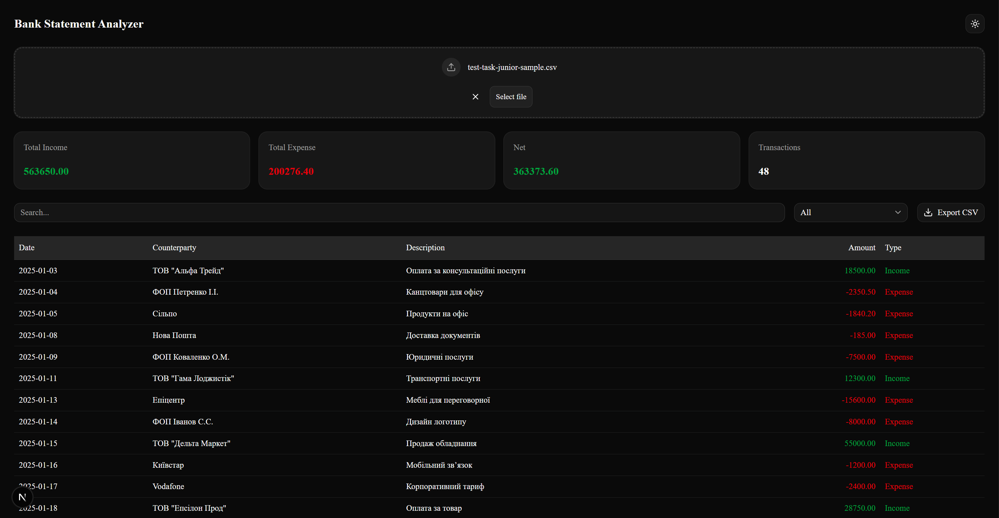

# Bank Statement Analyzer

A simple and efficient web application for analyzing bank statements from CSV files. Built with Next.js, Shadcn UI, and Zod.

## 🚀 How to Start

1. Clone the repository:
   ```bash
   git clone [https://github.com/your-username/bank-statement-analyzer.git](https://github.com/your-username/bank-statement-analyzer.git)
   ```
2. Install dependencies:
   ```bash
   npm install
   ```
3. Run the development server:
   ```bash
   npm run dev
   ```
4. Open http://localhost:3000 in your browser.

## 💡 About the Solution

Validation & Error Isolation: A significant portion of development time was dedicated to building a robust validation system using Zod. It was crucial not just to reject "broken" files, but to isolate and display invalid rows in a separate table. This approach allows users to identify and correct specific errors in the source file without interrupting the entire workflow.

Input Behavior Handling: An unexpected challenge was the browser's behavior when re-uploading the same file (the onChange event doesn't trigger if the filename remains unchanged). I resolved this by manually clearing the input's value immediately after selection, ensuring a predictable and seamless user experience even for repetitive uploads.

## 📸 Interface Preview


